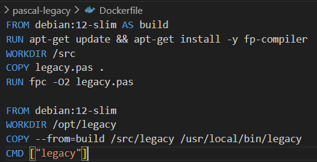
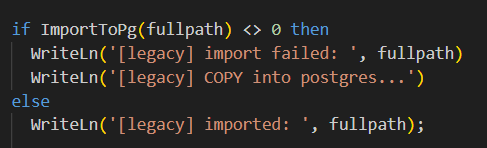
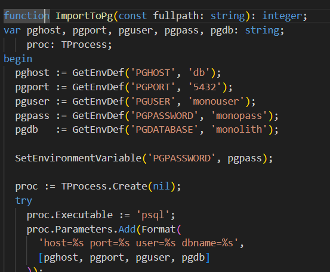
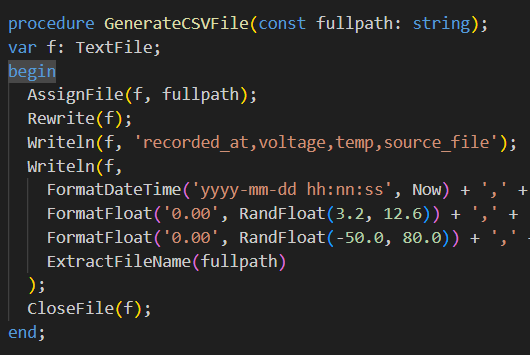
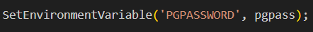
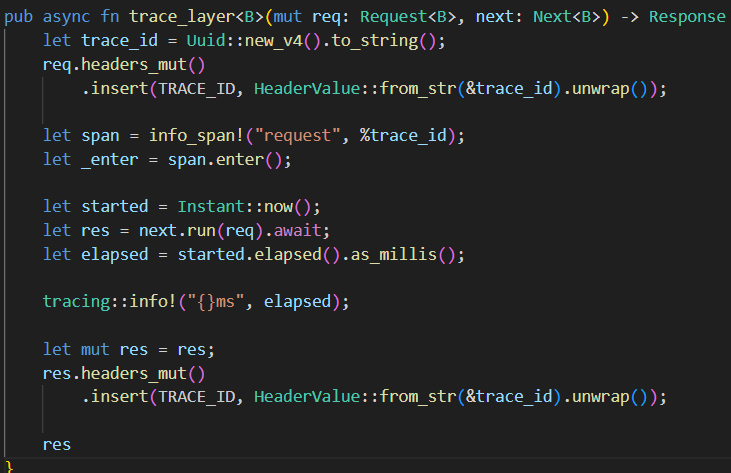
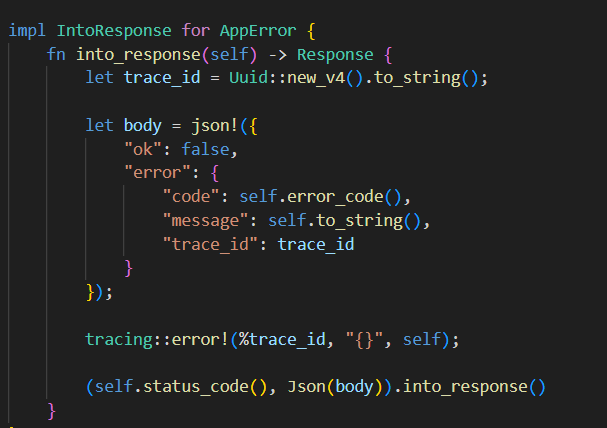
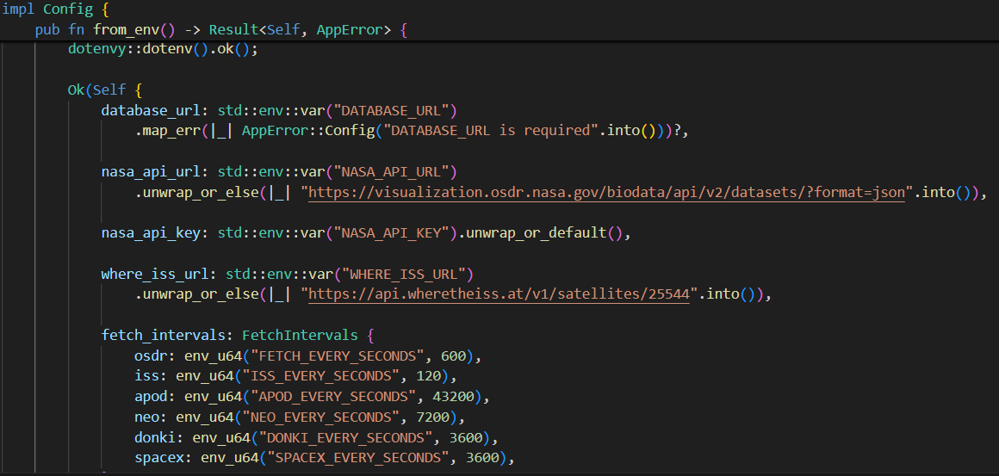
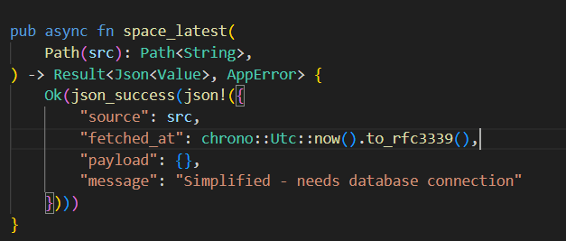

# Отчет

Изменения в проекте
- pascal-legacy:
  1. Разделение ответственности. Разделили стадии на build/run, чтобы сборка выполнялась один раз и не занимала время при старте контейнера. Начальная стадия строит бинарник, финальная — запускает только его
    
  2. Улучшение логирования. Вместо бесшумного выполнения операций добавлены диагностические сообщения. 
  
  3. Улучшена безопасность: использует TProcess вместо fpSystem защищает от инъекций
  
  4. сsv_gen.pas - отдельный модуль для генерации CSV
  
  5. Передача пароля в переменной окружения, а не в командной строке:
  

- rust-iss:
    1. Раньше логировалась только общая информация от tracing, без привязки к конкретному запросу. Добавлено middleware, которое: генерирует X-Request-Id, если его нет в запросе; добавляет trace-id в контекст tracing; логирует входящие запросы и результаты выполнения.
    
    2. Создан единый AppError для обработки ошибок. Все ошибки теперь в формате json:
    
    3. Вся конфигурация теперь в файле Config:
    
    4. handlers.rs - это слой, который только маршрутизирует HTTP-запросы и формирует ответы. Он не содержит бизнес-логики, только: извлечение данных из запроса (Path, Query, Body), вызов сервисов для выполнения бизнес-логики, формирование ответа в нужном формате, обработку ошибок от сервисов:
    
    5. файл db.rs отвечает за взаимодействие с базой данных PostgreSQL: создание пула соединений и инициализацию схемы БД (создание таблиц и индексов). создаёт три основные таблицы для хранения данных: iss_fetch_log - логи позиций МКС, osdr_items - данные из NASA OSDR, space_cache - универсальный кэш космических данных.
    6. файл services.rs содержит бизнес-логику приложения, разделённую на два сервиса: IssService - работа с данными МКС (получение последней позиции и запись в БД), OsdrService - работа с данными NASA OSDR.